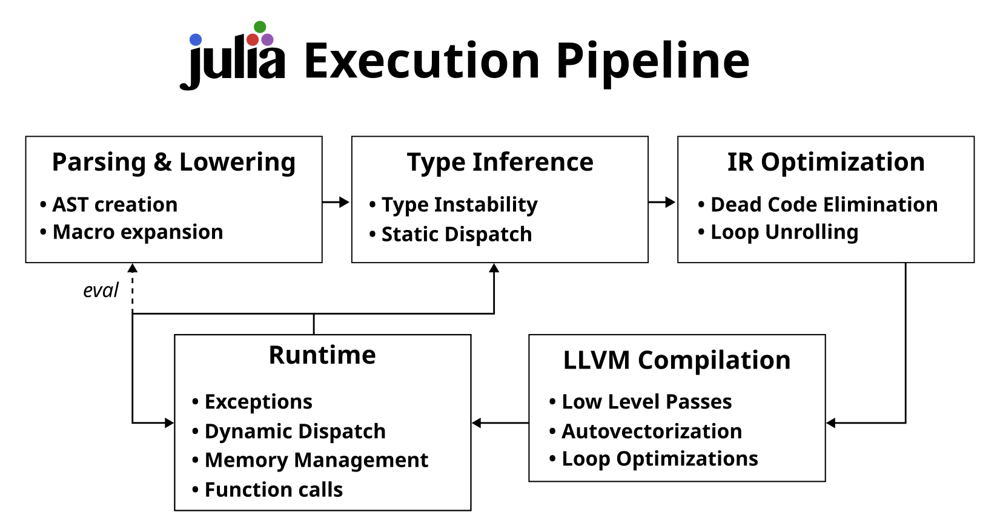

## Introduction

The Julia language, first released in 2012 [initialrelease](@cite), though not stabilized with version 1.0 until 2018 [firstmajor](@cite),
is a programming language targeting general and scientific computing. With a high-level, dynamic and interactive approach, while at the same
time aiming to achieve state of the art performance in a wide variety of fields, Julia is certainly greedy. High-level, dynamically typed and interactive
is traditionally at odds with high performance - the former more often associated with interpreted languages like Python, and the latter
with lower level languages working closer to the hardware, like C and C++. To achieve C-like performance while having a high level language,
it is necessary for users to keep the dynamically typed sections in mind while writing code. In this thesis, we provide a number of guidelines
and workflows for writing high level code with high performance, regarding the Julia type system, memory allocations as well as SIMD-level
optimizations.

This thesis is structured in three main parts. Chapter 2 gives background on the compilation model of Julia,
a short introduction to its type system, problems related to types typically encountered when developing code and how to investigate them on
the surface level.
Chapter 3 focuses on developing user code with these problems of the type domain in mind, what impact they have on runtime performance
when encountering them, how they can be fixed as well as how to diagnose them in a bigger codebase.
This part also provides guidelines for high-level optimization techniques applicable to most Julia codebases. These encompass
minimizing the number of allocations in a given piece of code, how these can be identified and how to reliably create benchmarks without
running into one of a number of potential pitfalls that novices to the intricacies of benchmarking might run into.
In the third and final part, in Chapter 4, we are going to look into microoptimizations on the level of
native machine code, techniques for encouraging the compiler to use SIMD instructions and how to use existing tooling to gather performance
statistics on the lowest level.

Finally, the appendix has a summary of Julia packages used for creating this thesis, as well as instructions for reproducing the graphs
and measurements contained within. We also include a section containing longer, whole code samples, which are used in Chapter 3
for analysis.

Familiarity with basic Julia syntax is assumed throughout this thesis, though more intricate concepts are gradually introduced by themselves.

## Background

While the Julia community is very eager about improving performance and educating others about how to write fast Julia code, little has
been written down about the techniques users of the language regularly apply in long-form text as one cohesive piece. Most information
about how to write fast Julia code is passed down through word of mouth, either by asking existing users for help when diagnosing
unexpected performance issues on community chat platforms such as the JuliaLang Slack [jlslack](@cite), the JuliaLang Zulip [jlzulip](@cite) or
the JuliaLang Discourse [jldiscourse](@cite). These media, while useful for one-on-one, direct assistance of an immediate problem, suffer from a sort of 
memory loss over time. As userbases shift and older discussions get pushed back in favor of newer ones, newcomers to the language
can easily be overwhelmed by the plethora of very specific questions with very problem specific answers. While most of these discussions
follow the same debugging and optimization principles under the hood, it can be hard to disentangle the general technique from the
specific application for a problem at hand. As such, these resources represent a wealth of \`\`locked\`\` information that requires quite
a bit of experience to search through and cannot be used as a general reference for optimization.

The problems encountered by users of Julia can generally be separated into three categories: type based, allocation based and finally 
SIMD instruction or vectorization based. The problems in the type domain are not generally new, though they have, to our knowledge,
not been formalized before. For instance, Cannon [cannon2005localized](@cite) presented a type inferencer of atomic types in Python, Chang et al. utilized runtime type inference
to specialize compilation of JavaScript [chang2007efficient](@cite), and historically Hölzle et al. [holzle1994optimizing](@cite) presented early work of dynamically providing type information to the compiler for their implementation of SELF.
The problem of type instability and the challenges it brings, while not formalized, is thus known in the literature.
The type system of Julia is described in great detail in the Phd thesis of Jeffrey Bezanson [bezansonthesis](@cite),
while a type calculus and a formal definition of type stability in the context of Julia has later been published by Pelenitsyn et al. [vitektypestability](@cite).
For the purposes of this thesis, a looser but more measurable definition is sufficient, which will be introduced separately. Regardless, the concept of type
stability, though not named as such, is a well-known problem for JIT optimization. Dynamic languages in particular can struggle with it,
though the problem manifests itself in different ways. For example, a lot of optimization techniques in JavaScript and its widely used
implementation in V8 [v8](@cite), the JavaScript engine powering Google Chrome, focus on the structural aspects of optimization based on the nature
of objects in JavaScript. Vyacheslav Egorov provides a great list of references in [egorov](@cite) about such
optimization in V8, as well as a detailed look [v8monomorphism](@cite) into how their JIT works
internally and how that relates to high-level optimized coding practices in JavaScript, where type stability is known as monomorphism.

Julia has bespoke tooling for allocation and memory profiling, which is sufficient for debugging in some cases. Combined with some minimal
knowledge about which constructs end up allocating memory in Julia, a skilled user can investigate more complex codebases without
resorting to more sophisticated techniques.
Allocation or memory profiling has large precedent in other languages, utilizing tools like valgrind [valgrind](@cite) or Pprof [pprof](@cite).
These tools can also be employed in Julia, though are generally not the first point for investigation and will not be covered in this thesis.

Finally, due to its compiled nature, Julia also allows for optimization on the SIMD level. Here too Julia employs custom tooling for
investigation. In languages like C or C++, tooling like LIKWID [likwid](@cite) or godbolt.org [godbolt](@cite) can be used for much the same effect,
though CPU specific tooling like intel VTune [vtune](@cite) or llvm-mca [llvm-mca](@cite) can be used too. Similar to memory profilers, Julia is also able
to utilize these, though this is not as common in the community as with external tooling in memory profiling. These too are an advanced topic
that will not be covered in this thesis.

##### Compilation Model



The high-level view of how a piece of Julia code moves from \`\`text in a file\`\` to \`\`executing program\`\` is roughly separable into these steps (see Figure 2.1):

 * Parsing and Lowering,
 * Type Inference,
 * Optimization Passes,
 * Compilation with LLVM,
   * LLVM specific passes,
   * Assembly generation, and
 * Execution

This is, a priori, the modern model for an optimizing, LLVM-based compiler. In contrast to traditional static Ahead Of Time (AOT) compilation
like gcc or clang, Julia employs a mix of AOT and Just In Time (JIT) compilation, often called \`\`Just Ahead Of Time\`\` by the community.
In essence, this means that Julia compiles as much as it can ahead of time, while inserting dynamic compilation points in case a type dynamic
decision needs to be made at runtime. Compared to JIT compilers, this results in doing a lot of the compilation work regardless of whether
the code is a particular measured hotspot or not. This has a significant upside, in that Julia is amenable to optimization techniques
employed in traditional static languages, while not sacrificing the ability for dynamicness, should it be required. While this is a desirable
feature for dynamicness and interactivity, it comes with a number of disadvantages. At any point, we may have to run type inference on
unknown or new code, run the various optimization passes required for this code, compile it to assembly using LLVM and finally continue
execution of the newly compiled assembly. As one can easily imagine, this alone can take up a significant amount of time. Some very
desirable workflows, such as the mentioned automatic differentiation of user code, inherently require this dynamic compilation, but most
other workloads do not. Still, naively written Julia code can inadvertently result in having to insert compilation steps, even if they
are not inherent to the problem at hand. Avoiding such performance pitfalls is the core tenet of basic performance optimization in Julia.

## Performance Pitfalls and Solutions

### Type Stability

One of the first applied concepts when identifying potential performance bottlenecks is called *type stability*. In essence, type stability
refers to the idea that the only factor deciding the return type of a function is the types of the input arguments to that function.

For example, consider the following function:

```@example warntype_foo
function foo(a::Float64)
    if a < 0.5
        return "A string."
    else
        return 0
    end
end
nothing # hide
```

The above takes a single argument, a 64-bit floating point number, and returns either a `String` or the 64-bit integer `0`. We can
investigate type stability issues on the topmost level with the macro `@code_warntype`, which calls the introspection function `code_warntype`
with the function `foo` and the types of the arguments passed to it, in this case a single `Float64`:

```@example warntype_foo
using InteractiveUtils # loaded by default in the REPL

@code_warntype foo(0.6)
```

The output of `@code_warntype` is structured in three main sections. First, type information about the called method is printed, along with
the type signature used by the compiler for type inference. Next, type information about local variables is printed, which is the most important
information to judge, at a glance, whether a function is internally type stable or not. It should be noted here that not all type instabilities
are equally bad, and some may even be desired. For example, if the type of a variable is inferred to be `Union{Nothing, Int64}`, it is usually
a local variable used in iteration. Such uses, limited as they are, are benign. In contrast, if a variable is annotated with an abstract type,
which we will investigate in more detail later, is an indicator that further investigation is required, if utmost type stability is desired.
Since type instability can have quite a big impact on performance, this is usually a desirable goal. We will take a look at the performance
impact of type stability in the next section.
Finally, the function body, the overall return type and a per-variable type annotation in the lowered Julia IR is printed, for more detailed
inspection.

Looking at the output for our function `foo` in particular, in either branch only a single value with a fixed type is returned. Since the compiler, when looking at this function in isolation, has no
knowledge about the value of the sole argument, it does not know which of the two it will be when the function is ultimately called. As a result,
the compiler creates a type union of the two possibilities, and the overall return type of the function becomes `Union{String, Int}`, as written
next to `Body` in the output above. For the purposes of this thesis it is not necessary to understand the lowered form of Julia that
`@code_warntype` produces to a very deep level. The documentation of JuliaInterpreter.jl [jlinterpreter](@cite) provides a sufficient introduction,
while a full reference can be found in the developer documentation [astdevdocs](@cite) of Julia. The only
difference between the output of `@code_warntype` and the raw lowered representation is the type annotations and indicators of type stability
added by the macro.

Functions that then call this `foo` function have to take these two possible results into account, since they too do not necessarily know the
exact value of what they passed in at the time of compilation. This can in turn lead to more dynamic calls when they use the value returned by
`foo`, because there may be more than one possibility for which method may be called subsequently with that value. These dynamic calls not only
have inherent overhead (they cannot be trivially inlined into the callee after all), they can also trigger delayed compilation of a new specialization,
should the called function not yet itself be compiled.

This concept of output types depending on input *values* instead of solely on their types can come up in a number of contexts. Explicit
switches returning vastly different kinds of objects like the above are rarer and sometimes more subtle.
Some cases of type instability in more complex code bases occur due to incomplete type parameters of fields in structs, or due to
accidental type promotion in one branch of the code but not another. In general, cases of type instability can always be traced to some
code that (unintentionally or not) relies on a runtime value, instead of just a type. We will look at these in detail later.

In numeric routines, it is more common to have type instabilites if care is not taken about returning the same type in each branch or when
accumulating a result into an inappropriately initialized variable:

```@example mySum
using InteractiveUtils # hide

function mySum(arr)
    acc = 0 # `acc` is an Int
    for a in arr
        acc += a # `a` could be of any type, e.g. Float64
    end
    return acc # `acc` may have changed type
end

redirect_stdout(devnull) do # hide
@code_warntype mySum([1.0,2.0])
end # hide
buf = IOBuffer() # hide
code_warntype(IOContext(buf, :color => true), mySum, (Vector{Float64},)) # hide
seekstart(buf) # hide
readuntil(buf, "Locals"; keep=false) # hide
data = readuntil(buf, "\e[90m1"; keep=false) # hide
print("...\nLocals", data, "...") # hide
nothing # hide
```

In the above example, we can see that the inferred return type when calling `mysum([1.0, 2.0])` is `Union{Float64, Int64}`, which is
also the inferred type of our accumulation variable `acc`. This happens due to type promotion of `acc` to `Float64` when `acc += a`
is executed, while we initialized it with a hardcoded `0`, an `Int`.
Since the passed in array could be empty and thus `acc` would never be promoted to a `Float64`, the function could return the initial
integer value, resulting in the observed type instability. One way to properly initialize the accumulator is by specifying the element
type of the vector in the function signature and using that to initialize the variable to the additive zero of our elements right away:

```@example mySum
function mySum_fix(arr)
     # `acc` is initialized to the same type as elements of `arr`
    acc = zero(eltype(arr))
    for a in arr
        acc += a # `acc` already has the same type as `a`
    end
    return acc # `acc` never changed type - code is type stable
end

redirect_stdout(devnull) do # hide
@code_warntype mySum_fix([1.0,2.0])
end # hide
buf = IOBuffer() # hide
code_warntype(IOContext(buf, :color => true), mySum_fix, (Vector{Float64},)) # hide
seekstart(buf) # hide
readuntil(buf, "Locals"; keep=false) # hide
data = readuntil(buf, "\e[90m1"; keep=false) # hide
print("...\nLocals", data, "...") # hide
nothing # hide
```

Generally speaking, if high performance is desired, type stability should be a goal when writing Julia code. This need not be required
across the board, but at least in hot loops and other hot codepaths where the application spends the majority of its time should be written
with type stability in mind. Thus, the first guideline presented in this thesis is: If possible, aim for type stability.

The reasoning for this is twofold:

 1. It is easier to explicitly insert dynamic points as necessary after the fact, if it turns out to be advantageous in terms of compilation time
    rather than debugging type instabilities once the code is done.
 2. It is in general very hard to judge which parts of a code base will be performance critical and which will be benign. While some educated
    guesses can be made, these educated guesses can often turn out very wrong as a codebase matures and new usecases for the existing
    code are discovered as new requirements not thought of in the original design come into play.

Of course, it is not always necessary or possible to have type stable code. For example, `eval` cannot be type stable, by its very nature.
Still, with the points above in mind, aiming for type stable code is generally the best course of action, to avoid unexpected surprises
down the road.

#### Abstractly Typed Fields In Structs

Julia's type system consists of a partial order of types. This builds a type lattice, at the top of which stands `Any`, the supertype of all types.
At the bottom of the type lattice stands `Union{}`, which is the subtype of all types. Conversely, `Any` is the subtype of no types and
`Union{}` is the supertype of no types. Between those two are abstract and concrete types. Abstract types can be subtyped, but they do not
have a memory layout - they are treated only as a mechanism for multiple dispatch. Objects at runtime always have some concrete type,
never an abstract type. Concrete types do have a memory layout, but conversely cannot be subtyped. This has practical purposes: since Julia favors
multiple dispatch and composition over inheritance, fields cannot be defined generically for all subtypes of an abstract type without the
use of metaprogramming.


Embedded in this lattice (Figure 3.1), Julia also has parametrized types called `UnionAll`. These define a whole family of types, in theory
infinitely many. These parametrized types are pervasive and ubiquituos - the first encounter new users have with these is usually in `Array`.

`Array{T,N} where {T, N}` has two type parameters: `T`, describing the type of elements held by the array and `N`, describing the dimensionality of the array.
For example, `Array{Int, 1}` is a one dimensional array, or vector, of `Int`s. Similarly, `Array{Float64, 2}` is a two dimensional array,
or matrix, of 64 bit floating point values. These two dimensionalitites are so common that they are aliased to `Vector{T} where T` and `Matrix{T} where T` respectively.
As long as a type has an unparametrized parameter, indicated by the `where T` part, it is a `UnionAll` describing the family of types where that
parameter is filled in.

Type parameters can be incompletely specified, to partially fill in what a type requires. This presents a problem: incompletely parametrizing
a type only eliminates a part of the declared family. For instance, `Array{Int}` means an array holding `Int` values, but of any dimensionality.
This is still a `UnionAll`, since it defines a family of types, not just one type. For users that are only familiar with one dimensional arrays,
for example due to familiarity with Java, which commonly represents matrices as a vector of vectors, this can lead to unintended type
instabilities:

```@example abstract_field
using InteractiveUtils # hide
struct MyStruct
   vals::Array{Int}
end

function myComplexFunc(m)
    data = m.vals
    acc = zero(eltype(data))
    for idx in axes(data, 2)
        acc += sum(x -> x^2, @view(data[:,idx]))
    end
    acc
end

data = reshape(1:10_000, (2,:)) |> collect
redirect_stdout(devnull) do # hide
@code_warntype myComplexFunc(MyStruct(data))
end # hide
buf = IOBuffer() # hide
code_warntype(IOContext(buf, :color => true), myComplexFunc, (MyStruct,)) # hide
seekstart(buf) # hide
readuntil(buf, "Locals"; keep=false) # hide
str = readuntil(buf, "\e[90m1"; keep=false) # hide
print("...\nLocals", str, "...") # hide
nothing # hide
```

This admittedly contrived example is type unstable when passing a `MyStruct` into `myComplexFunc`. The first and most benign is simply the assignment of
`data = m.vals`, which at least preserves the type we specified in the struct. The type of `acc` is also still stable, since we did specify
the element type in our field definition. However, getting the index along the second dimension for looping over them (`idx in axes(data, 2)`)
shows a type instability, even resulting in `Any`. From the output above, we can see that the return type of our `myComplexFunc` function
overall infers as `Any`, which is the most generic type Julia can offer; it is akin to giving up and not knowing what the function will return.
This means Julia is unable to really say anything at all about what type `idx` may have and in fact may even throw an error at runtime!
The reason for this is clear, if we take a look at what the compiler knows about `axes(data)`, which ultimately ends up being called when
calling `axes(data, 2)` above:

```@example abstract_field
code_warntype(axes, (Array{Int64},))
```

`axes` is a very simple function - creating ranges from `1` to the size of the passed in array for every dimension. Since the compiler does not
know the dimensionality of the array, we get a tuple of unknown length for `size`, and as such get a type instability here, due to the types of
the elements of a tuple being a part of the type of the tuple itself. Each element in the tuple is described by one type parameter to the tuple.
Ultimately, this results in `axes` inferring as `Any` after trying to create the ranges for each dimension.
The unknown result of `axes` then causes `Any` to be inferred for the type of `idx` in `myComplexFunc`, which leads to `Any` after the indexing operation into
`data`, which in turn leads to `Any` after the exponentiation and finally `Any` after summation. It should be clear that `Any` is very
pervasive and propagates easily up the callchain through return values, and as such, if the need for it arises, should be confined as much
as possible, if not prevented entirely.

Note that `myComplexFunc(MyStruct(data))` still executes perfectly fine and produces the correct result, it is just slow due to
the many `Any` leading to a lot of unnecessary intermediate allocations and dynamic dispatch:

```@repl abstract_field
@time myComplexFunc(MyStruct(data))
```

There are a couple of ways to alleviate, or in some cases completely mitigate, this problem. Each solution is only appropriate in some cases
and there is no \`\`one size fits all\`\` solution - in some cases, there may not even be a problem in the first place, if the instability
reduces compilation time and optimizing for that is more important than runtime dispatch.

One approach is to fully specify the dimensionality by hardcoding it into the field type:

```@example abstract_field
struct MyStructSpecified
   vals::Array{Int, 2}
   # or equivalently:
   # vals::Matrix{Int}
end
myComplexFunc(MyStructSpecified(data)) # hide
nothing # hide
```
```@repl abstract_field
@time myComplexFunc(MyStructSpecified(data))
```

This approach however removes our ability to put arbitrarily sized arrays into our struct. We can only construct an instance of our type
with two dimensional arrays:

```@repl abstract_field
MyStructSpecified([1,2,3])
```

The default constructor we are leaning on to create our object tries to convert the input arguments to the types specified in the fields,
which fails.

Another approach is to add a type parameter to our wrapper struct, to specify the dimensionality of the stored array:

```@example abstract_field
struct MyStructParametrized{N}
   vals::Array{Int, N}
end
myComplexFunc(MyStructParametrized(data)) # hide
nothing # hide
```
```@repl abstract_field
@time myComplexFunc(MyStructParametrized(data))
```

which preserves our ability to input arbitrary shapes:

```@repl abstract_field
MyStructParametrized([1,2,3])
```

Note that our input argument fully determined the type of `MyStructParametrized` - the type parameter `1` was inferred from us passing an
`Array{Int, 1}` as the first argument.

Finally, we can also use the type parameter to parametrize the struct field itself:

```@example abstract_field
struct MyStructFieldParam{T}
   vals::T
end
myComplexFunc(MyStructFieldParam(data)) # hide
nothing # hide
```
```@repl abstract_field
@time myComplexFunc(MyStructFieldParam(data))
```

This is by far the most flexible approach, but also allows a wider range of objects than we truly support. For example, we can pass a
`String` as argument to `MyStructFieldParam`, which then fails our `zero` call when trying to initialize `acc`:

```@repl abstract_field
myComplexFunc(MyStructFieldParam("foobar"))
```

On the other hand, it allows us to pass in a lazy representation of our data, if we have one:

```@repl abstract_field
lazy_data = reshape(1:10_000, (2,:))
typeof(lazy_data)
typeof(data)
all(Base.splat(==), zip(lazy_data, data)) && size(lazy_data) == size(data)
myComplexFunc(MyStructFieldParam(lazy_data)) # hide
@time myComplexFunc(MyStructFieldParam(lazy_data))
```

In this specific example, we are only saving memory by using a lazily reshaped range of values instead of materializing `data` completely.
This comes with additional advantages though, since we can apply our function to more or less anything that supports the array interface we are
relying on. Depending on the data we are using, there may be a richer representation computed lazily with a custom array type, specialized
for our usecase. By not restricting ourselves to just `Array` and its various concrete instances, we gain access to a very useful dynamism
and potential for optimization.

In order to still be strict enough to not accept objects like a `String`, we can restrict the type parameter in our field a bit:

```@example abstract_field
struct MyStructFieldParamRestricted{T <: AbstractArray}
    vals::T
end
```
```@repl abstract_field
myComplexFunc(MyStructFieldParamRestricted(data)) # hide
myComplexFunc(MyStructFieldParamRestricted(lazy_data)) # hide
@time myComplexFunc(MyStructFieldParamRestricted(data))
@time myComplexFunc(MyStructFieldParamRestricted(lazy_data))
@time myComplexFunc(MyStructFieldParamRestricted("foobar"))
```

Note how the error message communicates our field restriction as well, by notifying us that there is only one possible method whose sole
argument must be an object whose type is a subtype of `AbstractArray`.

With this knowledge about abstractly typed fields in mind, we can turn our attention to the second guideline: Be as precise with your types
as necessary, and as flexible as your problem allows. The general idea behind a type like `AbstractArray` is to provide some form of
expected behavior of subtypes of that type. Just as is the case with structs and their fields, if we write a function and only require
that function to be a 2-dimensional array, but don't need the exact `Matrix` from Base, it is generally better to only require `AbstractMatrix`,
instead of restricting the function argument unnecessarily. The flipside of course is that such looser bounds don't provide as many guarantees,
due to being more abstract in nature, and thus more care needs to be taken when writing such generic functions.

#### Capturing Variables In Anonymous Functions

One other subtle difficulty with type stability is related to closures, i.e. functions that capture some state of their surrounding scope.
For illustrative purposes, take this example:

```@example anon
function myanon(arr::Vector{T}) where T
    acc = zero(T)

    function fun(x)
        acc += x
    end

    for x in arr
        fun(x)
    end

    return acc
end
```

The function `fun` defined inside of `myanon` is said to capture `acc` from the outer scope. The `+=` thus writes to the `acc` variable
in `myanon` and not to a local variable inside of `fun`. We can use a type annotation to restrict dispatch and gain access to the type
parameters of the passed in argument, in this case `T`, the element type of `arr`, which we can pass to `zero` to initialize `acc` properly.

Looking at this seemingly innocouos function with `@code_warntype` paints a grim picture:

```@example anon
using InteractiveUtils # hide
redirect_stdout(devnull) do # hide
@code_warntype myanon([1,2,3])
end # hide
buf = IOBuffer() # hide
code_warntype(IOContext(buf, :color => true), myanon, (Vector{Int},)) # hide
seekstart(buf) # hide
readuntil(buf, "Locals"; keep=false) # hide
str = readuntil(buf, "\e[90m1"; keep=false) # hide
print("...\nLocals", str, "...") # hide
nothing # hide
```

The `Any` as the inferred return type may come as a surprise, since we took care to initialize `acc` with `zero(T)`, to ensure we are type
stable when aggregating. To understand what happens, consider this almost equivalent form of the above code:

```julia
struct fun1
    acc::Core.Box
end

function (f::fun1)(x)
    f.acc.contents = f.acc.contents + x
end

function myanon(arr::Vector{T}) where T
    acc = Core.Box()
    acc.contents = zero(T)

    _f = fun1(acc)
    for x in arr
        _f(x)
    end

    return acc.contents
end
```

This is more or less a high-level representation of the output of `@code_warntype` from above, closer to what the compiler sees our code as
after lowering the code from the initial input text to the first Julia specific representation of the source code.
We certainly did not annotate the struct field with `Core.Box` ourselves - it is inserted inserted by the compiler because we are writing to the
closed over variable `acc`. This step happens during code lowering in our compiler pipeline from earlier, which is before type inference gets
to run. At that point in time, we do not know whether `acc + x` would result in the same type that `acc` already had, because our variables are
not associated with types yet. We effectively inadvertently introduced a type instability, purely through our compile pipeline. `Core.Box` is
an untyped container, so our final access in `return acc.contents` has to infer `Any`, instead of our known `T`.

There is a relatively simple way around this problem in this case:

```@example anon
function myanon_stable(arr::Vector{T}) where T
    acc = Ref(zero(T))

    function fun(x)
        acc[] += x
    end

    for x in arr
        fun(x)
    end

    return acc[]
end
```

```@example anon
redirect_stdout(devnull) do # hide
@code_warntype myanon_stable([1,2,3])
end # hide
buf = IOBuffer() # hide
code_warntype(IOContext(buf, :color => true), myanon_stable, (Vector{Int},)) # hide
seekstart(buf) # hide
readuntil(buf, "Locals"; keep=false) # hide
str = readuntil(buf, "\e[90m1"; keep=false) # hide
print("...\nLocals", str, "...") # hide
nothing # hide
```

Instead of directly using `acc`, we get type stability by using `Ref(zero(T))`, which will end up as a `RefValue{T}`, a single element value
store. In contrast to `Core.Box`, the element type is stored in the type parameter, and so each access is type stable.
This trick is not always possible though - if the type of `acc` truly does change, we either have to know all possible types ahead of time
and use them in a `Union` in the type parameter of `RefValue`, or have to accept the instability of `Core.Box` in the worst case.
Using the `Ref` version in spite of the type changing may result in a conversion error when trying to assign its content:

```@repl conversion
r = Ref(1)
r[] = 3.1
```

There are a number of similar issues that can happen when utilizing variable capturing closures, and as such there are also a number of
different ways around the problem. For instance, for this function:

```@example anon
function foo()
    a = 1
    a = 2
    f() = a
end
```

which assigns `a` twice, leading to boxing of the variable:

```@example anon
redirect_stdout(devnull) do # hide
@code_warntype foo()
end # hide
buf = IOBuffer() # hide
code_warntype(IOContext(buf, :color => true), foo, ()) # hide
seekstart(buf) # hide
readuntil(buf, "Locals"; keep=false) # hide
str = readuntil(buf, "\e[90m1"; keep=false) # hide
print("...\nLocals", str, "...") # hide
nothing # hide
```

We can work around the issue by introducing a clarifying `let` block, eliminating the double assignment in the same scope as the definition
of the inner function `f`:

```@example anon
function foo()
    a = 1
    a = 2
    let a=a
        f() = a
    end
end
redirect_stdout(devnull) do # hide
@code_warntype foo()
end # hide
buf = IOBuffer() # hide
code_warntype(IOContext(buf, :color => true), foo, ()) # hide
seekstart(buf) # hide
readuntil(buf, "Locals"; keep=false) # hide
str = readuntil(buf, "\e[90m1"; keep=false) # hide
print("...\nLocals", str, "...") # hide
nothing # hide
```

Of course, the best course of action to avoid having to debug this is to not capture the variables in the first place, either by rewriting
the algorithm to not require the captured state in the inner function or expressing the same idea with a different abstraction.

This now leads us to the third guideline in terms of type stability: Beware of when Julia introduces a type instability.
This last guideline is very fuzzy, in that Julia can sometimes get cleverer with figuring out the type of a variable.
Thus, sections that were unstable in an older version may become stable in a newer version. Nevertheless,
avoiding type instabilities generally leads to cleaner and more performant code.

#### Third Party Tooling For Type Stability

Since `@code_warntype` is mostly useful for top level introspection and does not give direct access to the source of an instability,
other tools are needed to identify problems that occur deeper in existing libraries. Some of these problems may only manifest due to
an unexpected combination of libraries, which would work perfectly fine and be type stable in isolation. One thing most of these tools
have in common is that they work directly with the compiler - they are not reimplementing the existing type inference. As such,
these tools can pinpoint the exact locations that the compiler struggles with, because they are (colloquially speaking) just \`\`asking\`\`
the compiler where it failed.

##### Cthulhu.jl

One of the most powerful tools for exploring how the Julia compiler and its type inference see Julia code is Cthulhu.jl. It allows
interactive exploration of a given call, similar to `@code_warntype`. The crucial difference is that Cthulhu.jl allows descending into
inferred calls, taking the existing inference information into the debugging session. The motto of the package aptly follows suit -
\`\`The slow descent into madness\`\`.

We will examine how debugging type stability in a more involved setting works with a larger example of a gravitational simulation, in particular the
main function `update!`, which advances the state of the simulation. The full source code is available in Appendix 10.1.

```@setup cthulhu
using Random

struct Vec2
    x::Float64
    y::Float64
end
Base.zero(::Type{Vec2}) = Vec2(0.0, 0.0)

Base.:(+)(a::Vec2, b::Vec2) = Vec2(a.x + b.x, a.y + b.y)
Base.:(-)(a::Vec2, b::Vec2) = Vec2(a.x - b.x, a.y - b.y)
Base.:(*)(a::Vec2, b) = Vec2(a.x * b, a.y * b)
Base.:(*)(b, a::Vec2) = Vec2(a.x * b, a.y * b)

Random.rand(rng::AbstractRNG, ::Random.SamplerType{Vec2}) = Vec2((rand(rng) - 0.5) * 2, (rand(rng) - 0.5) * 2)

abstract type Particle end

struct BadParticle <: Particle
    mass
    pos
    vel
    acc
end

Particle(p::P; mass=p.mass, pos=p.pos, vel=p.vel, acc=p.acc) where { P <: Particle } = P(mass, pos, vel, acc)

mass(p) = p.mass

Base.zero(::Type{P}) where {P<:Particle} = P(0, zero(Vec2), zero(Vec2), zero(Vec2))

function Random.rand(rng::AbstractRNG, ::Random.SamplerType{P}) where P <: Particle
    mass = rand(rng) * 1000
    pos = rand(rng, Vec2) * 100
    vel = rand(rng, Vec2) * 10
    acc = rand(rng, Vec2)
    P(mass, pos, vel, acc)
end

function update(part::P) where P <: Particle
    p, v, a = part.pos, part.vel, part.acc
    v += a
    p += v
    P(part.mass, p, v, a)
end

# Gravitational Constant
const G = 6.67430e-11

function acceleration(p1, p2)
    vec = p1.pos - p2.pos
    dist = vec.x^2 + vec.y^2
    sqdist = sqrt(dist)
    F = G * p1.mass * p2.mass / (dist*sqdist)
    Vec2(vec.x * F, vec.y * F)
end

struct System{P <: Particle}
    particles::Vector{P}
end

function escapes(sys, p)
    body = argmax(mass, sys.particles)
    dist = body.pos - p.pos
    d = sqrt(dist.x^2 + dist.y^2)
    ve = sqrt(2*body.mass*G/d)
    pvel = sqrt(p.vel.x^2 + p.vel.y^2)
    pvel >= ve
end

function update!(s)

    # update accelerations
    for part_idx in eachindex(s.particles)
        cur_part = s.particles[part_idx]
        acc_new = Vec2(0.0, 0.0)

        # make sure to skip self-acceleration
        for upd_idx in 1:(part_idx-1)
            acc_new += acceleration(s.particles[upd_idx], cur_part)
        end
        for upd_idx in (part_idx+1):lastindex(s.particles)
            acc_new += acceleration(s.particles[upd_idx], cur_part)
        end

        s.particles[part_idx] = Particle(cur_part, acc=acc_new)
    end

    # update velocities and positions
    for part_idx in eachindex(s.particles)
        npart = update(s.particles[part_idx])
        s.particles[part_idx] = npart
    end

    nothing
end
```

A cursory, top-level look with `@code_warntype` suggests that the code is fine:

```@example cthulhu
using InteractiveUtils # hide
s = System(rand(BadParticle, 100))
redirect_stdout(devnull) do # hide
@code_warntype update!(s)
end # hide
buf = IOBuffer() # hide
code_warntype(IOContext(buf, :color => true), update!, (typeof(s),)) # hide
seekstart(buf) # hide
readuntil(buf, "Locals"; keep=false) # hide
str = readuntil(buf, "\e[90m1"; keep=false) # hide
print("...\nLocals", str, "...") # hide
nothing # hide
```

However, the example is anything but. Our `BadParticle` struct, as defined, is missing the type declarations on each field, so uses of those fields
will be type unstable due to the type of the returned object not being defined purely from knowing that we accessed the field of a `BadParticle`.
To simulate a type instability in an inner method, we have also added a second convenience constructor and forced it to be inferred as `Any`.

Cthulhu.jl can help with these kinds of instabilities by allowing us to interactively dive into the calls our function is making and displaying
the type information (as well as other, more advanced functionality) of each call. The main entry point for this is the `@descend` macro,
which, similar to `@code_warntype`, takes a function call as we would make them normally.

Calling the macro on our function and hiding type stable statements by pressing `h`, followed by `T` for 
displaying the type annotated code shows us this:

```julia
julia> s = System(rand(BadParticle, 10));

julia> @descend update!(s)
# ...
update!(s::System) @ Main REPL[24]:1
   ∘ ── %0 = invoke update!(::System)::Core.Const(nothing)
   51 ─ %123 = Base.getfield(%24, :mass)::Any││╻        getproperty
   52 ─ %124 = Base.getfield(%24, :pos)::Any │││      
   53 ─ %125 = Base.getfield(%24, :vel)::Any │││      
Select a call to descend into or ↩ to ascend. [q]uit. [b]ookmark.
Toggles: [o]ptimize, [w]arn, [h]ide type-stable statements, [d]ebuginfo, [r]emarks, [e]ffects, [i]nlining costs, [t]ype annotations, [s]yntax highlight for Source/LLVM/Native.
Show: [S]ource code, [A]ST, [T]yped code, [L]LVM IR, [N]ative code
Actions: [E]dit source code, [R]evise and redisplay
Advanced: dump [P]arams cache.
 • %49 = invoke acceleration(::BadParticle,::BadParticle)::Vec2
   %105 = invoke acceleration(::BadParticle,::BadParticle)::Vec2
   %166 = invoke update(::BadParticle)::BadParticle
   ↩
```

By default, Cthulhu.jl displays the typed representation also shown by `@code_warntype`. The difference is that Cthulhu.jl also shows
optimized code, which means small function calls may have already been inlined into the original call. Hiding type stable statements
reduces the amount of shown code massively, allowing users to focus on the type unstable statements indicating a problem.

Looking at the output above, Cthulhu.jl shows three type instabilities where a called function returns `Any`, each a `getfield` call accessing
the `mass`, `pos` or `vel` field of an object respectively. Unhiding type stable statements by pressing `h` again and looking for the
variable that's being passed in, we can figure out that `%24` is of type `BadParticle` by looking at its assignment:

```julia
...
5  │    %23  = Base.getfield(s, :particles)::Vector{BadParticle}  getproperty
   │    %24  = Base.arrayref(true, %23, %21)::BadParticle         getindex
9  │    %25  = Base.sub_int(%21, 1)::Int64           │╻        -
...
```

This means that accessing any of those fields of a `BadParticle` object is type unstable, which is exactly what we'd expect from our definition
in the original source code, since it is lacking any type annotations.

Additionally, Cthulhu.jl also shows calls with internal type instabilities at the bottom, in this case `acceleration(::BadParticle, ::BadParticle)`
and `update(::BadParticle)`. Since the arguments involved are exclusively of type `BadParticle`, these inner instabilities
are also due to the untyped fields in `BadParticle`. Looking at `acceleration`, for example:

```julia
acceleration(p1, p2) @ Main REPL[18]:1
Body::Vec2
2 1 ─ %1  = Base.getfield(p1, :pos)::Any                                 │╻ getproperty
  │   %2  = Base.getfield(p2, :pos)::Any                                 ││
  │   %3  = (%1 - %2)::Any                                               │ 
3 │   %4  = Base.getproperty(%3, :x)::Any                                │ 
  │   %5  = Base.literal_pow(Main.:^, %4, $(QuoteNode(Val{2}())))::Any   │ 
  │   %6  = Base.getproperty(%3, :y)::Any                                │ 
  │   %7  = Base.literal_pow(Main.:^, %6, $(QuoteNode(Val{2}())))::Any   │ 
  │   %8  = (%5 + %7)::Any                                               │ 
4 │   %9  = Main.sqrt(%8)::Any                                           │ 
5 │   %10 = Base.getfield(p1, :mass)::Any                                │╻ getproperty
  │   %11 = Base.getfield(p2, :mass)::Any                                ││
  │   %12 = (Main.G * %10 * %11)::Any                                    │ 
  │   %13 = (%8 * %9)::Any                                               │ 
  │   %14 = (%12 / %13)::Any                                             │ 
6 │   %15 = Base.getproperty(%3, :x)::Any                                │ 
  │   %16 = (%15 * %14)::Any                                             │ 
  │   %17 = Base.getproperty(%3, :y)::Any                                │ 
  │   %18 = (%17 * %14)::Any                                             │ 
```

we can observe that there are no type stable calculations being done anywhere. Due to the input fields of `BadParticle` being
typed `Any`, there is no hope for improving the situation by only looking at the function itself.

##### JET.jl

One tool that automates the process of diving into a function and finding dynamic dispatch due to type problems is JET.jl,
which also uses the intrinsic capabilities of the Julia compiler to help users investigate their type stability problems.

The initial type stability investigations with JET.jl can be done with the `@report_opt` macro, which functions in a similar fashion
to `@code_warntype`. It takes the function to analyze, as well as its arguments, and returns a report of places where dynamic dispatch
occurs, indicating that the arguments are not of a concrete type. This usually means that the arguments are a result of a type
unstable operation.

In addition, JET.jl provides the `code_opt` function for manual inspection, in case constructing an object purely for analysis is
expensive or would require external resources that may not be available.

It should be noted that JET.jl cannot look through dynamic dispatch into function calls, so fixing the type instabilities
presented here and rerunning the check may produce more or different results again. The reason for this can be found in the nature of
dynamic dispatch: since it is undefined what exact method will be called at runtime, JET.jl can not know which method to analyze.
In order to avoid ambiguities that would occur due to analyzing all possible variants, JET.jl instead chooses not to analyze those 
dynamic calls further. The caveat for this is that JET.jl may report more instabilities when the object returned by a type unstable function
is used often in the calling function. This is an important point - it is not dynamic dispatch itself that is slow, but the type instability
causing it can also cause subsequent calls to be unstable. The type instability propagates, causing less optimal code to be compiled
after it occurs, resulting in an overall slowdown.

Looking at what JET.jl reports for our `update!` function reveals all of the dynamic dispatches localized to the internal calls,
that do not show up in a top-level analysis with `@code_warntype` of just `update!` alone:

```julia
using JET
@report_opt update!(s)
```

While large, this output is still fairly contained. We can see that it is made up of two larger blocks, pointing us yet again
towards `acceleration` and `update` on a particle input, just like `Cthulhu.jl` does above:

```text
═════ 17 possible errors found ═════
┌ @ index.md:598 Main.acceleration(s.particles[upd_idx], cur_part)
│┌ @ index.md:567 %1 Main.:- %2
││ runtime dispatch detected: (%1::Any Main.:- %2::Any)::Any
│└────────────────
│...
┌ @ index.md:609 npart = Main.update(s.particles[part_idx])
│┌ @ index.md:558 %2 Main.:+ %3
││ runtime dispatch detected: (%2::Any Main.:+ %3::Any)::Any
│└────────────────
│┌ @ index.md:559 %1 Main.:+ %4
││ runtime dispatch detected: (%1::Any Main.:+ %4::Any)::Any
│└────────────────
```

In general, the output is grouped by function calls. JET.jl tells us that it found dynamic dispatches in two locations, `acceleration` and
`update`, as well as where in the source code the expression is written. This is consistent with what Cthulhu.jl reported - both utilize
information queried from the compiler after all. For `acceleration`, almost every function call done inside ends up having to dispatch
dynamically.

JET.jl also provides a different macro, `@report_call`, with a slightly different purpose: reporting type errors instead of dynamic dispatch.
That is, `@report_call` finds and reports possible runtime errors, for example where an exception would be thrown that isn't caught further
up the call stack or where a method call is statically known not to succeed:

```@example report_call
using JET # hide
f() = Int(4.5)

@report_call f()
```

`@report_call` in general operates in one of three modes. The default is `basic`, which only reports errors
that are guaranteed to occur in every call. The second is `sound`, which reports any errors that can occur. The third is `typo`, which reports
errors that are a result of undefined global variables or access of an undefined field. Refer to the documentation [jetdoc](@cite)
for a more thorough description of each mode.

```@example cthulhu
using JET # hide
@report_call update!(s)
```

While no errors are reported, this may be a red herring as long as we still have dynamic dispatch identified by `@report_opt`, since a possible
type error may occur in one of the methods called at runtime, which JET.jl cannot see. As such, it is best to use `@report_call` (or the equivalent
function) once `@report_opt` does not report any problems anymore (or on individual inner calls, if dynamic dispatch is unavoidable).

On top of this caveat, the method written as-is may still throw other errors, uncovered by the `:sound` mode:

```@example cthulhu
using InteractiveUtils # hide
s = System(rand(BadParticle, 100))
@report_call mode=:sound update!(s)
res = @report_call mode=:sound update!(s) # hide
buf = IOBuffer() # hide
show(IOContext(buf, :color => true), res) # hide
seekstart(buf) # hide
str = readuntil(buf, "update!"; keep=false) # hide
print(str, "...") # hide
nothing # hide
```

### Memory Management

Memory management plays a crucial role in the development of highly performant Julia code. While there are a number of memory profiling tools for other languages like C and Lisp like mprof [Zorn:CSD-88-404](@cite) or Dr. Memory [bruening](@cite), the capabilities
for doing the same work in Julia are rather poor. Julia does have some builtin capability for memory profiling [profilejl](@cite),
but even those approaches are typically useful when diagnosing a bigger codebase, and not helpful when investigating
standalone functions. In this section, we are going to focus on some patterns that cause allocations.

While Julia does not require a programmer to manually allocate raw blocks of memory
as in C or other low level languages due to the existence of a garbage collector (GC) in the language runtime, it is nevertheless important to be aware of which language constructs
tend to allocate memory that needs to be handled by the GC. In general, these are mutable objects, such as arrays, dictionaries, mutable structs or the like. Writing code with
these in mind can significantly improve performance of even benign looking code, possibly enabling a faster turnaround for a scientific analysis.

#### A problematic example

In this example, we can take a look at the impact the allocation, tracking and cleanup of memory has on performance. Consider this code:

```@example onehot
function onehot(data, labels)
    [ data == l for l in labels ]
end

function onehotbatch(sequence, labels)
    reduce(hcat, [ onehot(s, labels) for s in sequence ])
end
nothing # hide
```

This is a simple version of a batched one-hot encoding, as is common in machine learning applications. For each element in `sequence`,
we call `onehot(s, labels)` to determine which datapoint we are looking at. `onehot` itself simply returns a boolean array, with exactly
one true value. In the end, we concatenate all individual `onehot` vectors together into one big matrix, to be used in our machine learning
framework. We can take a look at how this function performs using the `@time` macro:

```@example onehot
using Random: randstring

onehotbatch("a", 'a':'d') # hide
alphabet = 'a':'d'
for s in (10_000, 100_000, 1_000_000, 10_000_000, 100_000_000)
   sequence = randstring(alphabet, s)
   @time onehotbatch(sequence, alphabet)
end
```

A priori, we would expect to see at most one allocation for one invocation of `onehotbatch`, due to the string being of a known length with a known alphabet.
The output size is on the order of $$O(n*m)$$, where $n$ is the length of the string and $m$ is the number of distinct letters in our alphabet. As such, it should
be possible to allocate the resulting data all at once, but instead we're seeing more allocations for successively longer strings, correlating perectly.
In each successive iteration we input a 10 times larger string, which leads to a 10 times larger number of allocations. When looking at wall-clock time,
we start out with an increase by a factor of about 15, before then settling on a factor 10 increase per larger input.
With larger sizes, as more and more intermediate allocations are created that are not persistent after execution, we see the garbage collector starting to collect
some of it, adding some overhead itself, accounting for ~40% of the total runtime (see Figure 3.2).

```@setup onehot
dir = dirname(@__DIR__)
isfile(joinpath(dir, "figs/onehot.png")) && return

using CairoMakie
using Serialization
using Printf

function tickf(x)
    map(x) do e
        L"10^{%$e}"
    end
end

function percTick(x)
    map(x) do e
        @sprintf "%3.1f%%" 100*e
    end
end

f = Figure()
ax1 = Axis(f[1,1], title = "Timings of naive `onehotbatch`", xlabel = L"Inputsize", ylabel = "Runtime/Total time", xtickformat = tickf, ytickformat = percTick)
ax2 = Axis(f[1,2], title = "Allocations of naive `onehotbatch`", xlabel = L"Inputsize", ylabel = "Allocations (MiB)", xtickformat = tickf)

datapath = joinpath(dir, "data", "onehot") |> expanduser
sizes = 4:8
if !isfile(datapath)
    times = [@timed(onehotbatch(randstring(alphabet, 10^s), alphabet)) for s in sizes]
    data = reduce(times, init=(time=Float64[], bytes=Int[], gctime=Float64[])) do x, r
        push!(x.time, r.time)
        push!(x.bytes, r.bytes)
        push!(x.gctime, r.gctime)
        x
    end
    mkpath(dirname(datapath))
    serialize(datapath, data)
else
    data = deserialize(datapath)
end

ylims!(ax1, 0, 1)
colors = [:blue, :red]
barplot!(ax1, sizes, fill(1, length(sizes)), color=colors[2])
barplot!(ax1, sizes, data.time./(data.gctime.+data.time), color=colors[1])
barplot!(ax2, sizes, data.bytes / 1024 / 1024)
axislegend(ax1, [PolyElement(polycolor=colors[i]) for i in 1:2], ["Program", "GC"], tellheight=false, tellwidth=false,
                    margin=(10,10,10,10), position=:lb)
mkpath(joinpath(dir, "figs"))
save(joinpath(dir, "figs/onehot.png"), f; px_per_unit=3)
```

This is generally indicative of a problem in our code. As the size of the input grows, we need to keep track of more and more memory in the current implementation of
`onehotbatch`, while for any given string and alphabet it is possible to infer the total required size of the output. As such, it should not be necessary to
have an increase in dynamic memory used for this function. This is not always possible, but for functions where it is, allocating the required memory up-front can improve performance significantly.
How this can be done in practice and what changes to the code are required for this to be easier will be investigated in the next section.

It should be noted that `@time` is a very naive timing mechanism. The syntax transform done by this macro does little more than take
the difference between the system time before and after the execution of the called code, with some querying of the garbage collector for
allocation statistics of the code in question. As such, while the number of allocations is accurately reported, the timings may be influenced
heavily by noise and be dependent on the general load of the machine the code is time on, as only a single execution is used.


#### Microbenchmarks

Since the timing noise is especially problematic for microbenchmarks, i.e. benchmarks of very tight loops or single function calls, an external
package like BenchmarkTools.jl is often used instead of `@time`. The benchmark macros provided by this package are geared towards microbenchmarks -
the enclosed expressions are run multiple times, allowing some basic statistical analysis of runtime characteristics. This comes at a cost:
due to the statistical nature, the usually fixed number of allocations lose accuracy, due to being averaged over multiple runs.
Special care is taken to alleviate GC interruptions and to prevent compile time latency of the first call to affect the overall timing.
Another advantage is the possibility of providing a setup phase for each benchmark sample, allowing a user to customize the input, as well
as isolating the cost of preparing the input from the actual execution.

BenchmarkTools.jl is a good first indicator for diagnosing performance problems in somewhat small pieces of code or in hot loops and is often
enough for a trained eye to spot bottlenecks. As an example, here is a run on our `onehot` and `onehotbatch` functions:

```@repl onehot
using BenchmarkTools
filebench = joinpath(dirname(@__DIR__), "data/onehotbench.json") # hide
filenaive = joinpath(dirname(@__DIR__), "data/onehotnaive.json") # hide
using Logging
if (!isfile(filebench) || !isfile(filenaive)) # hide
    b1 = @benchmark onehot(data, labels) setup=(labels='a':'d'; data=rand(labels)) # hide
    BenchmarkTools.save(filebench, b1) # hide
    b2 = @benchmark onehotbatch(data, labels) setup=(labels='a':'d'; data=randstring(labels, 10^4)) # hide
    BenchmarkTools.save(filenaive, b2) # hide
end # hide
if false # hide
@benchmark onehot(data, labels) setup=(labels='a':'d'; data=rand(labels))
else # hide
BenchmarkTools.load(filebench) |> only # hide
end # hide
if false # hide
naive = @benchmark onehotbatch(data, labels) setup=(labels='a':'d'; data=randstring(labels, 10^4))
else # hide
naive = BenchmarkTools.load(filenaive) |> only # hide
end # hide
```

We can see that `onehot` allocates once, which is the encoded array of its input. We can also see that `onehotbatch` allocates roughly
`10^4` times, which is the size of our input string. Since `onehot` already allocates once and we call `onehot` once for each character in
the input string, we can reasonably infer that the vast majority of these allocations stem from `onehot`. While there is some work ongoing
in the core language to elide such small allocations, avoiding them is of course still the best approach.

With that knowledge in hand, there is a number of things we can do. First, when we are calling `onehotbatch`, we already know how large our
output matrix is going to be. We have `la = length(alphabet)` different labels and an input of `ls = length(sequence)`, so we are going to
build a $$la \times ls$$ matrix for our onehot encoding. By allocating the final size once, instead of building a larger one progressively from
smaller arrays, we can cut both time and allocations.

```@example onehot
function onehotbatch_prealloc(sequence, labels)
    res = Matrix{Bool}(undef, length(labels), length(sequence))

    for seq in axes(res, 2)
        s = sequence[seq]
        res[:, seq] = onehot(s, labels)
    end

    res
end
```

Let us first check whether our new code has the same result:

```@repl onehot
labels = 'a':'d';
function check_func(f, labels)
    str = randstring(labels, 10^4)
    all(Base.splat(==), zip(onehotbatch(str, labels), f(str, labels)))
end
check_func(onehotbatch_prealloc, labels)
```

And finally, whether it was an improvement:

```@repl onehot
fileprealloc = joinpath(dirname(@__DIR__), "data/onehotprealloc.json") # hide
if !isfile(fileprealloc) # hide
pre = @benchmark onehotbatch_prealloc(data, labels) setup=(labels='a':'d'; data=randstring(labels, 10^4))
    BenchmarkTools.save(fileprealloc, pre) # hide
else # hide
    pre = BenchmarkTools.load(fileprealloc) |> only # hide
end # hide
judge(median(pre), median(naive))
```

This alone is not enough though - we are still allocating once per character when we call `onehot`. To prevent that, we have three options -
writing a mutating function to use instead of our `onehot`, broadcasting or inlining the loop.

Let us first examine the mutating function:

```@example onehot
function onehot!(dst, data, labels)
    for idx in eachindex(dst, labels)
        dst[idx] = data == labels[idx]
    end
end

function onehotbatch_mutating(sequence, labels)
    res = Matrix{Bool}(undef, length(labels), length(sequence))

    for seq in axes(res, 2)
        s = sequence[seq]
        slice = res[:, seq]
        onehot!(slice, s, labels)
    end

    return res
end
```

Note that we call our mutating function `onehot!`, with a trailing exclamation mark. The reason for this is out of practicality - when reading
code, the exclamation mark gives the reader an indication that one or more of the arguments passed to this function will be mutated by the
called function. This is a purely informational convention and is not enforced by the compiler, though some style guides or linters may.

```@repl onehot
filemutate = joinpath(dirname(@__DIR__), "data/onehotmutate.json") # hide
if !isfile(filemutate) # hide
mutated = @benchmark onehotbatch_mutating(data, labels) setup=(labels='a':'d'; data=randstring(labels, 10^4))
BenchmarkTools.save(filemutate, mutated) # hide
else # hide
mutated = BenchmarkTools.load(filemutate) |> only # hide
end # hide
judge(median(mutated), median(naive))
judge(median(mutated), median(pre))
```

We have encountered a severe regression! At first glance, this may be unexpected - our new `onehot!` does not allocate after all. We can confirm
this by calling our function under `@allocated`, which gives us the number of bytes that are allocated in the enclosed call:

```@repl onehot
dst = zeros(Bool, length(labels));
onehot!(dst, 'a', labels) # hide
@allocated onehot!(dst, 'a', labels)
```

However, looking back at how we had to modify `onehotbatch`, we made a mistake. `slice = res[:, seq]` creates a copy of the data we are trying
to fill, which leads not only to a regression instead of an improvement in time, but also to a wrong result, due to the data not being
written back into our preallocated array:

```@repl onehot
check_func(onehotbatch_mutating, labels)
```

The fix is simple enough. By using the `@view` macro, we can instead construct a lightweight view of part of the original array, which shares
the underlying data with the parent array. This allows us to allocate one big result matrix, take views into it and work on that individually.
Fixing this finally improves performance substantially:

```@example onehot
function onehotbatch_view(sequence, labels)
    res = Matrix{Bool}(undef, length(labels), length(sequence))

    for seq in axes(res, 2)
        s = sequence[seq]
        slice = @view res[:, seq]
        onehot!(slice, s, labels)
    end

    return res
end
```

```@repl onehot
check_func(onehotbatch_view, labels)
fileview = joinpath(dirname(@__DIR__), "data/onehotview.json") # hide
if !isfile(fileview) # hide
view = @benchmark onehotbatch_view(data, labels) setup=(labels='a':'d'; data=randstring(labels, 10^4))
BenchmarkTools.save(fileview, view) # hide
else # hide
view = BenchmarkTools.load(fileview) |> only # hide
end # hide
judge(median(view), median(naive))
judge(median(view), median(pre))
judge(median(view), median(mutated))
```

We successfully cut execution time and we are only using 5% as much memory as our naive reduction version.

Using `@view` for slices into the existing allocation is not the only way we can improve performance. We can also inline the loop directly
or use broadcasting for a similar effect. Depending on the existing architecture of our codebase or personal preference, one solution or
another or a combination of them may be more appropriate.

```@example onehot
function onehotbatch_broadcast(sequence, labels)
    res = Matrix{Bool}(undef, length(labels), length(sequence))

    for seq in axes(res, 2)
        s = sequence[seq]
        res[:, seq] .= s .== labels
    end

    return res
end

function onehotbatch_inline(sequence, labels)
    res = Matrix{Bool}(undef, length(labels), length(sequence))

    for seq in axes(res, 2)
        s = sequence[seq]
        for l in axes(res, 1)
            res[l, seq] = s == labels[l]
        end
    end

    return res
end
nothing # hide
```

```@repl onehot
broadc = @benchmark onehotbatch_broadcast(data, labels) setup=(labels='a':'d'; data=randstring(labels, 10^4))
inline = @benchmark onehotbatch_inline(data, labels) setup=(labels='a':'d'; data=randstring(labels, 10^4))
judge(median(broadc), median(view))
judge(median(broadc), median(naive))
judge(median(inline), median(view))
judge(median(inline), median(naive))
```

In total, we can achieve quite a substantial improvement compared to our naive version, showing the importance of proper benchmarking and
optimization.

### Low-Level Builtin Tooling

A big part of a common Julia workflow is working at least partially in the REPL. The REPL is one of the longest standing builtin pieces of
tooling available to users and as such is often used for interactive exploratory analysis of all kinds, such as the usage of JET.jl or
Cthulhu.jl shown earlier. Unlike these high-level analysis tools, the REPL, through the `InteractiveUtils` standard library, also has
rudimentary tooling for lower level analysis at almost every level of the compiler pipeline.

It should be noted that results of these stages are somewhat brittle, in the sense that seemingly innocuous changes on source code can have a
relatively large impact on downstream optimizations and thus performance, albeit on a very different scale than the impact of allocations or
type instability. Due to this \`\`hierarchy of impact\`\`, optimizations from this point onward are mostly of interest when the absolute highest
performance is needed.

#### LLVM-IR And Native Code Inspection

One of the stages in the Julia compilation pipeline is compilation to native code by LLVM, the Low Level Virtual Machine. In order to use it
for compilation, Julia generates an LLVM specific intermediate representation, called LLVM-IR, of the parsed and optimized high-level source
code. This is a very useful tool for figuring out whether Julia itself can successfully optimize a certain operation, e.g. vectorizing a
numerical routine or eliding error cases or bounds checks.

While not necessarily a perfect heuristic for estimating the performance of a kernel function, looking at the LLVM-IR can nevertheless
help in diagnosing where in the compiler pipeline an expected optimization fails, which is particularly useful for bounds check elision.
As a general rule of thumb, if Julia can successfully vectorize a loop, it must have been able to prove those accesses inbounds.

Such introspection of the generated LLVM IR can be done using `@code_llvm`. Looking at our `mySum_fix` from earlier, we can see that
Julia is already able to vectorize it in some cases:

```@example mySum
redirect_stdout(devnull) do # hide
@code_llvm mySum_fix([1,2,3])
end # hide
buf = IOBuffer() # hide
code_llvm(IOContext(buf, :color => true), mySum_fix, (Vector{Int},)) # hide
seekstart(buf) # hide
readuntil(buf, "%vector.ph\e[39m\n"; keep=true) # hide
data = readuntil(buf, "; │┌ @ essentials.jl:13"; keep=false) # hide
print("...", data, "...") # hide
nothing # hide
```

Note the sections containing `<8 x i64>` above, indicating that our function was automatically vectorized into instructions working on 8
`Int64` elements at a time.

However, this is not guaranteed and depends on the element type. For example, the same function but taking in a `Vector{Float64}` does
not vectorize, as can be seen by the lack of any LLVM instructions containing `< N x Type >`:

```@example mySum
redirect_stdout(devnull) do # hide
@code_llvm debuginfo=:none mySum_fix([1.0, 2.0, 3.0])
end # hide
buf = IOBuffer() # hide
code_llvm(IOContext(buf, :color => false), mySum_fix, (Vector{Float64},); debuginfo=:none) # hide
seekstart(buf) # hide
readuntil(buf, "L35:"; keep=true) # hide
data = readuntil(buf, "\n\nL41"; keep=false) # hide
print("...\nL35:", data, "\n...") # hide
nothing # hide
```

This is because floating point addition is not associative and without explicitly allowing reordering, Julia does not make use of transforms
doing so. This vectorization can be achieved locally with the macro `@fastmath`, which is equivalent conceptually to the `-ffast-math` flag of
other compilers like `clang`. The advantage of the macro is that its effects are localized to its lexical scope and do not affect other code at all -
fastmath CPU flags or other such sideeffects do not leak outside of the localized use to other parts of the program.
It should be noted that this must be used inside of the desired function - the macro cannot look into a function call and replace what the function
ends up doing internally. As with any macro, it can only operate on the expression it has been given, not what that expression does in internal calls.

The `@code_native` macro gives the same introspection capabilities as `@code_llvm`, except it shows the native machine code LLVM compiles as a result of the
input of the LLVM IR passed from Julia:

```@example mySum
redirect_stdout(devnull) do # hide
@code_native debuginfo=:none mySum_fix([1.0, 2.0, 3.0])
end # hide
buf = IOBuffer() # hide
code_native(IOContext(buf, :color => false), mySum_fix, (Vector{Float64},); debuginfo=:none) # hide
seekstart(buf) # hide
readuntil(buf, ".LBB0_6"; keep=true) # hide
data = readuntil(buf, ".LBB0_6"; keep=false) # hide
print("...\n.LBB0_6", data, ".LBB0_6\n...") # hide
nothing # hide
```

One iteration of the loop loads 8 `Float64` values and adds them to the accumulator variable stored in `xmm0`, successively. Even though this is making use of a SIMD register,
the addition itself is not vectorized and still happens in a scalar fashion.

Inspecting functions with `@code_native` or `@code_llvm` can thus be a good indicator for investigating whether a given optimization, such as autovectorization,
was applicable to the code in question. In some instances, this can prevent long benchmarking sessions, though the existence of SIMD instructions should not be
taken as an absolute guarantor for performance.

## Performance Tuning: A Case Study

While inspecting the generated assembly in an interactive session is useful for sanity checking, how often this is required in practice
can vary from problem to problem. As an example, we ported versions 0 through 5 of the course material from Chapter 2 of
CS-E4580 Programming Parallel Computers [cse4580](@cite) from Aalto university to Julia, matching the various optimizations
applied in the original C++ source code. The C++ code was compiled with `g++ -g -O3 -march=native -std=c++17 -shared -fPIC -fopenmp step.cpp -o step.so`
to allow it to be dynamically linked in Julia, using the same benchmarking setup with `BenchmarkTools.jl`. The complete source code
for the following benchmark sections can be found in Appendix 9.1.

The case study itself consists of step-by-step optimization of a simple graph
problem, the shortcut problem. The task is to find the minimum cost from
one node to another in a fully connected bidirectional graph, taking at
most two edges. This includes paths with only one edge, as each node
is connected to itself with an edge costing `0`.

For the original C++ code, a good introduction to optimization is given by Agner Fog in [agneroptimizing](@cite). While written with C++ and its constructs in mind,
the general feel of reducing runtime interactions and thinking about the hardware presented in later chapters are just as applicable to Julia as they are to C++.
In the following sections, we are going to look at how we might apply the general lessons learned from C++ to a Julia port.

An initial naive translation of the original C++, without taking advantage of Julia specifics, looks like this:

```julia
function v0!(r, d, n)
    for i in 0:n-1
        for j in 0:n-1
            v = Inf32
            for k in 0:n-1
                x = d[n*i + k + 1]
                y = d[n*k + j + 1]
                z = x + y
                v = min(v, z)
            end
            r[n*i + j + 1] = v
        end
    end
end
```

Which results in this timing:

```text
julia> @benchmark v0!(r, d, n) setup=(n=4000;r=zeros(Float32,n,n);
    d=rand(Float32,n,n);d[1:(n+1):(n*n)].=0f0) evals=1
BenchmarkTools.Trial: 1 sample with 1 evaluation.
 Single result which took 167.610 s (0.00% GC) to evaluate,
 with a memory estimate of 0 bytes, over 0 allocations.
```

Compared to the 99 seconds reported by CS-E4580, the 167 seconds for one call here may be surprisingly slow. The difference lies once again in floating
point semantics. `min` in Julia strictly follows IEEE, returning `NaN` on e.g. `min(NaN, 0.5)`, while `std::min` does not - it returns `0.5` for the same inputs due to following the implementation of IEEE in the x86
computer architecture.o The tradeoff is performance vs. correctness. The semantics of x86 are correct as long as there are no `NaN` involved. To remedy this, we will be using some Julia specific switches in our baseline,
as well as insert some checks to allow us to make certain optimizations in the first place in order to align the execution model with what x86 expects.

The function implementing this has the following signature, adapted from the signature of CS-E4580 by translating to Julia:

```
vX!(r::Matrix{Float32}, d::Matrix{Float32})
```

There is no explicit parameter for passing the length of one side of the square matrices passed in, because a `Matrix` in Julia
already provides us with this information using the `size` function. Note again the trailing exclamation mark in the
function name, indicating that the function will modify one or more of its arguments, usually the first argument.

### Baseline

The first step of action is to retrieve the size of one side of the source data array and using it to check that both the input matrix as well as the output matrix is square and
the same size. This is a crucial step, as we will see.

```julia
function v0nothreads!(r, d)
    n = size(d, 1)
    @boundscheck size(d) == (n, n)  || throw(ArgumentError("Input matrix is not square"))
    @boundscheck size(d) == size(r) || throw(ArgumentError("Output matrix is not the same size as input matrix: $(size(r)) should be $(size(d))"))

    for i in 1:n
        @inbounds for j in 1:n
            v = Inf32
            for k in 1:n
                x = d[j, k]
                y = d[k, i]
                z = @fastmath x + y
                v = @fastmath min(v, z)
            end
            r[j, i] = v
        end
    end
end
```

Compared to the raw C++ version, this Julia version has two initial differences: To allow the compiler to fuse floating point addition
and reorder operations, the Julia version, unlike C++, requires use of the `@fastmath` macro. This is for safety reasons - since floating
point addition is not associative, reordering operations can lead to tremendously different results and thus should only be done
with great caution. Additionally, `@fastmath` allows the compiler to assume that no floating point value used here will be a `NaN`,
which results in directly using hardware instructions without any compensation necessary. The default Julia implementation for `min`, for
example, is `NaN` aware, which results in additional checks to be performed to ensure a correct result. In contrast, C++ leans on the
behavior of the underlying hardware. On x86 architectures, this does not follow IEEE 754 semantics - the `minss` instructions will
only return `NaN` if the `NaN` is the second argument:

```@repl
@fastmath min(NaN, 0.2)
@fastmath min(0.2, NaN)
```

In this program, this subtle difference of semantics does not matter, since we do not perform any operations involving `NaN`, so
it is safe to use `@fastmath` here. `@fastmath` can be seen as an equivalent to `--fast-math` in various C compilers, with the difference
that it does not influence the program globally - under the hood, the macro only replaces certain function calls, such as `min`, with
non-IEEE conforming versions, to allow the compiler to emit the corresponding hardware instruction without additional safeguarding.
Such a local transform is much safer than the indiscriminate effects `--fast-math` has, because there is no
chance of leaking `--fast-math` behavior just from linking a library compiled with that flag.

The other difference in V0 to the C++ version is `@inbounds`. Since C++ does not perform bounds checking on pointer accesses like those
in the reference implementation by default, we also disable it in our hot loop. This too must be done with care - disabling boundschecking
is no different from unchecked pointer dereferencing in C or C++ and can lead to segmentation faults instead of well-formed exceptions
that can be caught and handled. It is good practice to use `@boundscheck` to perform a manual check of the possible indices used in the loop
ahead of the loop, to keep both performance and program safety.
Additionally, `@inbounds` forbids the compiler from using proofs about inboundsness from affecting the result and can in some instances
lead to an overall slowdown of some codes, due to no longer being able to constant fold functions involving it. However, in our case all
data we operate on is dynamic in nature and cannot be constant folded. This, combined with our explicit bounds checking before our loops
ensures that the use of `@inbounds` here is safe.

These modifications then result in the expected timing, matching C++:

```text
julia> @benchmark v0nothreads!(r, d, n) setup=(n=4000; r=zeros(Float32,n,n); d=rand(Float32,n,n); d[1:(n+1):(n*n)].=0f0) evals=1
BenchmarkTools.Trial: 1 sample with 1 evaluation.
 Single result which took 109.100 s (0.00% GC) to evaluate,
 with a memory estimate of 0 bytes, over 0 allocations.
```

We can confirm that we're doing the same operations as the C++ version is doing by checking the generated assembly:

```asm
[...]
.LBB0_10:                               # %L105.us.us
                                        #   Parent Loop BB0_8 Depth=1
                                        #     Parent Loop BB0_9 Depth=2
                                        # =>    This Inner Loop Header: Depth=3
; │ @ src/step.jl:14 within `v0!`
; │┌ @ essentials.jl:14 within `getindex`
	vmovss	(%rbx,%rcx,4), %xmm2            # xmm2 = mem[0],zero,zero,zero
; │└
; │ @ src/step.jl:15 within `v0!`
; │┌ @ fastmath.jl:165 within `add_fast`
	vaddss	(%rdx), %xmm2, %xmm2
; │└
; │ @ src/step.jl:16 within `v0!`
; │┌ @ fastmath.jl:244 within `min_fast`
; ││┌ @ essentials.jl:575 within `ifelse`
	vminss	%xmm2, %xmm1, %xmm1
; │└└
; │ @ src/step.jl:17 within `v0!`
; │┌ @ range.jl:891 within `iterate`
; ││┌ @ promotion.jl:499 within `==`
	incq	%rcx
	addq	%rdi, %rdx
	cmpq	%rcx, %rax
; │└└
	jne	.LBB0_10
[...]
```

Which is indeed the case, aside from minor differences such as the exact order of operations on unrelated registers, as well as the exact
registers used. We can thus be confident that we not only get equivalent assembly output, but can also replicate the exact semantics
of C++ (or rather, the semantics of the underlying hardware) in Julia, if need be.

Finally, as a last high-level optimization step multithreading is introduced. The C++ version makes use of OpenMP for this, while Julia
has a native threading implementation shipped as part of the standard library, in the form of the `Threads` module. Usage is similar, as the
`@threads` macro is used to annotate a loop for multithreading:

```julia
using Base.Threads

function v0!(out, data)
    n = size(data, 1)
    @boundscheck size(data) == (n, n)  || throw(ArgumentError("Input matrix is not square"))
    @boundscheck size(data) == size(r) || throw(ArgumentError("Output matrix is not the same size as input matrix"))

    Threads.@threads for i in 1:n
        @inbounds for j in 1:n
            v = Inf32
            for k in 1:n
                x = data[j, k]
                y = data[k, i]
                v = @fastmath min(v, x + y)
            end
            out[i, j] = v
        end
    end
end
```

As a point of comparison, these are the timings of C++ V0 versus the corresponding Julia versions of V0, with `@inbounds` and `@fastmath`
and without, as well as with threading:


As mentioned above, using `@inbounds` and `@fastmath` gives us the same semantics that C++ uses, of following the hardware implementation. Adding `@threads` then also cuts the execution time according to the number
of threads available to us (Figure 4.1).

### Transposed Matrix

V1 is the first foray into achieving better performance, by making use of a temporary matrix for better cache efficiency. Julia uses column
major ordering for its arrays and while C++ uses row major, the trick for a more cache friendly memory layout is the same: transposing
the input data and using the transposed copy instead of indexing the original data in a cache unfriendly manner. Due to the memory layout
of arrays, the innermost loop is looping over the first index instead of the second one:

```julia
function v1!(out, data)
    n = size(data, 1)
    @boundscheck size(data) == (n, n)  || throw(ArgumentError("Input matrix is not square"))
    @boundscheck size(data) == size(r) || throw(ArgumentError("Output matrix is not the same size as input matrix"))

    tran = Matrix{Float32}(undef, n, n)
    Threads.@threads for col in 1:n
        @inbounds for row in 1:n
           tran[col,row] = data[row,col] 
        end
    end
    
    Threads.@threads for row in 1:n
        @inbounds for col in 1:n
            v = Inf32
            for block in 1:n
                x = data[block, col]
                y = tran[block, row]
                v = @fastmath min(v, x + y)
            end
            out[row, col] = v
        end
    end
end
```

As with the C++ version, the temporary array fixes the scaling behavior due to the better cache behavior.


We can also see a significant bump in performance for smaller problem sizes (Figure 4.2), which we are going to investigate in the next section,
together with the optimizations applied in `v2!` and `v3!`.

### Padding Data

V2 and V3 are all about giving certain guarantees about the length of our data, to allow us work on blocks of data at once, instead of
one by one. The first step to achieve this in V2 is to pad the data in memory-order to a multiple of 4. In Julia, this means padding
the columns to a multiple of 4 and leaving the rows the same length. Conversely, due to its row-major nature, the code in C++ pads rows instead.
Due to the great multidimensional support `Matrix` offers, this transform leaves the sourcecode almost identical. The only major difference is the initialization of the matrix with `Inf32`, which
is done here with a multidimensional comprehension:

```julia
using Base.Cartesian: @nexprs, @ntuple

function v2!(out, data_)
    n = size(data, 1)
    @boundscheck size(data) == (n, n)  || throw(ArgumentError("Input matrix is not square"))
    @boundscheck size(data) == size(r) || throw(ArgumentError("Output matrix is not the same size as input matrix"))

    blocksize = 4
    nblocks = div(n + blocksize - 1, blocksize)
    colsize = nblocks*blocksize

    data = [ Inf32 for _ in 1:colsize, _ in 1:n ]
    tran = [ Inf32 for _ in 1:colsize, _ in 1:n ]
    Threads.@threads for row in 1:n
        @inbounds for col in 1:n
            data[col,row] = data_[col,row]
            tran[col,row] = data_[row,col]
        end
    end
    
    Threads.@threads for row in 1:n
        @inbounds for col in 1:n
            @nexprs 4 l -> v_l = Inf32
            for block in 1:blocksize:colsize
                @nexprs 4 blockidx -> begin
                    x = data[block+blockidx-1, col]
                    y = tran[block+blockidx-1, row]
                    v_blockidx = @fastmath min(v_blockidx, x + y)
                end
            end
            vt = @ntuple 4 v
            out[row, col] = @fastmath minimum(vt)
        end
    end
end
```

To achieve the unrolling by a factor of 4, there is no need to introduce additional loops in Julia and hope for the compiler to unroll the loop for us. We can achieve the same effect by
making use of the `Cartesian` module, which provides us with various utility macros to generate a multitude of expressions from a seed
expression. This is very useful for preventing mistakes due to copy and paste of lines of code and can be used to generate relatively complex
expressions, as we will see later. In V2, we are only making use of two: `@nexprs`, which expands the seed expression to `N` copies of itself
while replacing the given symbol in that expression with a counter. The other macro in use here is `@ntuple`, which takes an expression
and builds a tuple out of the expanded result. Since both of these macros expand during parsing, there is no inherent runtime overhead.
We can use `@macroexpand` to inspect the output of the macros:

```@repl
using Base.Cartesian: @nexprs # hide
@macroexpand @nexprs 4 l -> v_l = Inf32
```

The resulting expression is interpolated as-is into the caller, replacing the macro invocation entirely during parsing - the later stages in the compiler only see the expanded expression. Similarly, `@ntuple`
creates a tuple literal of the given expression:

```@repl
using Base.Cartesian: @ntuple # hide
@macroexpand @ntuple 4 v
```

There is also a downside to `Cartesian` - due to the macro being expanded during parsing, no runtime information is accessible. In particular,
we cannot use the the `blocksize` variable to pass the size to expand by to the macro, since the variable quite literally does not have
a value at the time of expansion. Arguably, the variable does not even exist yet, only the name for it does. Regardless of this, the places we have to change are
easily recognizable and should not be too numerous.

V3 is conceptually the same as V2, except the multiple we are padding to is now 8, matching the maximum SIMD register width for `Float32` on the i7 6600U.

```julia
function v3!(out, data_)
    n = size(data_, 1)
    @boundscheck size(data_) == (n, n)  || throw(ArgumentError("Input matrix is not square"))
    @boundscheck size(data_) == size(r) || throw(ArgumentError("Output matrix is not the same size as input matrix"))

    blocksize = 8
    nblocks = div(n + blocksize - 1, blocksize)
    colsize = nblocks*blocksize

    data = Matrix{Float32}(undef, colsize, n)
    tran = Matrix{Float32}(undef, colsize, n)
    Threads.@threads for row in 1:n
        @inbounds for col in 1:colsize
            data[col,row] = col <= n ? data_[col,row] : Inf32
            tran[col,row] = col <= n ? data_[row,col] : Inf32
        end
    end
    
    Threads.@threads for row in 1:n
        @inbounds for col in 1:n
            # v_1, v_2, ..., v_8
            @nexprs 8 l -> v_l = Inf32
            for block in 1:blocksize:colsize
                @nexprs 8 blockidx -> begin
                    x = data[block+blockidx-1, col]
                    y = tran[block+blockidx-1, row]
                    v_blockidx = @fastmath min(v_blockidx, x + y)
                end
            end
            vt = @ntuple 8 v
            out[row, col] = @fastmath minimum(vt)
        end
    end
end
```

We now have three conceptually similar algorithms with the only proper difference being the explicit loop unrolling we have done in V2
and V3. Naively, we would expect the absolute performance to match between the Julia code and the C++ code, but if we actually run a comparison,
we find something astounding (Figure 4.3).


V1 in Julia already handily beats V2 in C++, matching the performance of the hand-unrolled and with basic SIMD optimizations applied V3 in C++!
This should be explained by our use of `@fastmath`, allowing the compiler to reorder the floating point operations. As mentioned above,
in order for C++ to have the same opportunity in V1 would require passing `--fast-math` during compilation, which may end up contaminating
linked programs, depending on the compiler version and linking flags [fastmath](@cite). In contrast, the local-only behavior of `@fastmath`
allows the compiler to take advantage of fastmath semantics without impacting surrounding code, helping substantially and not requiring
manual unrolling by hand to do a good job. This is not to say that it will always work, but that the semantics of Julia code coupled with
the local control that `@fastmath` and `@inbounds` give can be a big boon to performance without costly developer effort spent on unrolling.

An additional explanation could be that Julia can assume that the two arrays being iterated over, the original data array as well as its materialized transpose, do not alias.
The C++ version may not be able to assume this, thus requiring the explicit use of SIMD instructions to achieve the same result. At this point in time,
we are unable to confirm this hypothesis and further research is required.

### SIMD

With `v4!` is now the first time where we have to use the Julia equivalent of SIMD compiler intrinsics in C++. Contrary to the explicit
alignment of memory with `posix_memalign`, arrays in Julia are already aligned to multiples of 16 bytes [arralign](@cite). This
is not enough for a full `NTuple{8, Float32}`and unfortunately, there is currently no way to communicate an alignment to the allocator.

Additionally, Julia does not have builtin intrinsics for specific architecture instructions and instead interfaces with LLVM for these, by
emitting appropriate LLVM IR. This interface is provided by the `SIMD` package, which abstracts the size of the vector operations away
with the `Vec` type. We can use this type in the following way, by providing a tuple as argument:

```julia-repl
using SIMD
v = Vec((1,2,3,4))
w = Vec((5,6,7,8))
v + w
```

Note how we did not have to use broadcasting for the addition - a `Vec` acts as a single element for these arithmetic operations, to
mirror the semantics of the underlying vector operations. Using this type, we can now make small changes to `v3!` to arrive at `v4!`,
adding another layer of blocking other than our desired vector width:

```julia
using SIMD
using SIMD: Vec

function v4!(out, data_)
    n = size(data_, 1) # matrix is square
    @boundscheck size(data_) == (n, n)  || throw(ArgumentError("Input matrix is not square"))
    @boundscheck size(data_) == size(out) || throw(ArgumentError("Output matrix is not the same size as input matrix"))

    vectorwidth = 8
    nvectors = div(n + vectorwidth - 1, vectorwidth)
    colsize = nvectors*vectorwidth # number of rows

    blockwidth = 3
    nblocks = div(n + blockwidth - 1, blockwidth)
    rowsize = nblocks*blockwidth # number of columns

    data = Matrix{Float32}(undef, colsize, rowsize)
    tran = Matrix{Float32}(undef, colsize, rowsize)
    Threads.@threads for row in 1:rowsize
        @inbounds for col in 1:n
            data[col,row] = row <= n ? data_[col,row] : Inf32
            tran[col,row] = row <= n ? data_[row,col] : Inf32
        end
    end
    @inbounds for row in 1:rowsize
        for col in n+1:colsize
            data[col,row] = Inf32
            tran[col,row] = Inf32
        end
    end

    Threads.@threads for row in 1:blockwidth:n
        @inbounds for col in 1:blockwidth:n
            # v_1_1_1, v_1_1_2, ..., v_2_1_1, ..., v_3_3_8
            @nexprs 3 l -> begin
            @nexprs 3 k -> begin
                v_k_l = Vec(@ntuple 8 _ -> Inf32)
            end
            end

            for block in 1:vectorwidth:colsize
                # x_1_1, ..., x_3_8
                # y_1_1, ..., y_3_8
                @nexprs 3 k -> y_k = Vec(@ntuple 8 i -> tran[block+(i-1), row+(k-1)])
                @nexprs 3 k -> x_k = Vec(@ntuple 8 i -> data[block+(i-1), col+(k-1)])

                @nexprs 3 k -> begin
                @nexprs 3 l -> begin
                    v_k_l = @fastmath min(v_k_l, x_k + y_l)
                end
                end
            end
            
            @nexprs 3 l -> begin
            @nexprs 3 k -> begin
                out_row = row+(l-1)
                out_col = col+(k-1)
                if out_row <= n && out_col <= n
                    out[out_row, out_col] = @fastmath minimum(v_k_l)
                end
            end
            end
        end
    end
end
```

Conceptually, the explicit packing into `float8_t` in C++ results in reordering of the data in memory. The resulting matrix of single
`Float32` elements is the same total size, but the dimensions changed which results in better caching behavior due to fewer cache misses.
Note how, unlike the C++ version, we again did not have to repeat ourselves in the inner loops. We can simply take advantage of the fact that
`Vec` already takes a tuple, combining it with our use of `@ntuple` to stay concise and again avoiding mistakes due to copy and paste. 


Although the Julia version does not store the `Vec` objects directly in the array and instead loads the vectors via `@ntuple` in the
hot loop explicitly, the performance compared to C++ is equivalent. This makes sense - the purpose of the `float8_t` type defined in
the reference C++ implementation is mainly used to guarantee the alignment of the elements of the array and to communicate the desire
for vector instructions to the compiler. Since Julia currently does not allow specification of alignment and `Vec` already emits appropriate
IR depending on the size, we have the freedom to take the stylistic choice not to define a `const float8 = Vec{8, Float32}` alias,
keeping our algorithm more generic for future modification in regards to vectorizaton size.

### Unrolled SIMD

`v5!` is now conceptually very similar to `v4!`. The explicit reflowing now leads to a very thin, but long matrix, almost eliminating
cache misses entirely. The core algorithm now relies on specific assembly instructions being emitted, for which the C++ version
explicitly calls the given compiler intrinsics. `SIMD.jl` gives us a wrapper function around the corresponding LLVM IR in `shufflevector`,
which we give a shuffle mask. Notably, while Julia is generally indexed starting with `1`, this shuffle mask starts with `0`, following the
definitions in LLVM.

```julia
using Base: setindex

swap4(nt::T) where T = shufflevector(nt, Val((4, 5, 6, 7, 0, 1, 2, 3)))
swap2(nt::T) where T = shufflevector(nt, Val((2, 3, 0, 1, 6, 7, 4, 5)))
swap1(nt::T) where T = shufflevector(nt, Val((1, 0, 3, 2, 5, 4, 7, 6)))

function v5!(out, data_)
    n = size(data_, 1) # matrix is square
    @boundscheck size(data_) == (n, n)  || throw(ArgumentError("Input matrix is not square"))
    @boundscheck size(data_) == size(out) || throw(ArgumentError("Output matrix is not the same size as input matrix"))

    blocksize = 8
    nblocks = div(n + blocksize - 1, blocksize) # number of vertical blocks in data_
    colsize = n*blocksize # save n*blocksize elements per column

    data = Matrix{Float32}(undef, colsize, nblocks)
    tran = Matrix{Float32}(undef, colsize, nblocks)
    Threads.@threads for row in 1:nblocks
        @inbounds for col in 1:n
            for jb in 1:blocksize
                j = (col-1)*blocksize + jb
                i = (row-1)*blocksize + jb
                data[j, row] = i <= n ? data_[i, col] : Inf32
                tran[j, row] = i <= n ? data_[col, i] : Inf32
            end
        end
    end

    Threads.@threads for colidx in 1:nblocks
        @inbounds for rowidx in 1:nblocks
            # v_1, v_2, ..., v_8
            v = @ntuple 8 l -> Vec(@ntuple 8 _ -> Inf32)

            for block in 1:blocksize:colsize
                a_0 = Vec(@ntuple 8 blockidx -> data[block+blockidx-1, colidx])
                b_0 = Vec(@ntuple 8 blockidx -> tran[block+blockidx-1, rowidx])
                a_4 = swap4(a_0)
                a_2 = swap2(a_0)
                a_6 = swap2(a_4)
                b_1 = swap1(b_0)
                @nexprs 4 l -> begin
                @nexprs 2 k -> begin
                    z = @fastmath a_{2*(l-1)} + b_{k-1}
                    res = @fastmath min(v[2*(l-1)+k], z)
                    v = setindex(v, res, 2*(l-1)+k)
                end
                end
            end

            @nexprs 4 idx -> v = setindex(v, swap1(v[2*idx]), 2*idx)
            
            for col_block in 1:blocksize
                for row_block in 1:blocksize
                    row = row_block + (rowidx-1)*blocksize
                    col = col_block + (colidx-1)*blocksize
                    if row <= n && col <= n
                        idx = xor(row_block-1, col_block-1)
                        el = v[idx + 1][row_block]
                        out[col, row] = el
                    end
                end
            end
        end
    end
end
```

With this, we have reached performance parity yet again (see Figure 4.5).


## Conclusion and Future Work

In this thesis, we have gone over basic guidelines for diagnosing and fixing common performance issues and pitfalls often encountered by newcomers to the Julia programming language. While the guidelines
presented here can carry a lot of weight, even when scaled up to larger codebases, there are a number of more advanced debugging techniques that can be employed, in particular when third party libraries
with, to the user of such a library, unknown code is involved. In particular, there are various techniques in relation to allocation profiling, generalization of performance oriented code from CPU
to GPU parallelization, as well as performance diagnosis with tools like LIKWID [likwid](@cite), Intel® VTune™ or LLVM-Analyzer. There are
also additional profiling steps that can be taken with tools such as Pprof [pprof](@cite) or Valgrind [valgrind](@cite) that we have not covered in this work.
We leave systemization of knowledge and aggregation into one cohesive work about these more advanced approaches to future work, though the interested reader will find various resources for each of these online
(with the caveat of these resources not being integrated into one cohesive whole).

## Bibliography

```@bibliography
```

## Appendix

### Gravitational Simulation

```julia
using Random

struct Vec2
    x::Float64
    y::Float64
end
Base.zero(::Type{Vec2}) = Vec2(0.0, 0.0)

Base.:(+)(a::Vec2, b::Vec2) = Vec2(a.x + b.x, a.y + b.y)
Base.:(-)(a::Vec2, b::Vec2) = Vec2(a.x - b.x, a.y - b.y)
Base.:(*)(a::Vec2, b) = Vec2(a.x * b, a.y * b)
Base.:(*)(b, a::Vec2) = Vec2(a.x * b, a.y * b)

Random.rand(rng::AbstractRNG, ::Random.SamplerType{Vec2}) = Vec2((rand(rng) - 0.5) * 2, (rand(rng) - 0.5) * 2)

abstract type Particle end

struct BadParticle <: Particle
    mass
    pos
    vel
    acc
end

Particle(p::P; mass=p.mass, pos=p.pos, vel=p.vel, acc=p.acc) where { P <: Particle } = P(mass, pos, vel, acc)

mass(p) = p.mass

Base.zero(::Type{P}) where {P<:Particle} = P(0, zero(Vec2), zero(Vec2), zero(Vec2))

function Random.rand(rng::AbstractRNG, ::Random.SamplerType{P}) where P <: Particle
    mass = rand(rng) * 1000
    pos = rand(rng, Vec2) * 100
    vel = rand(rng, Vec2) * 10
    acc = rand(rng, Vec2)
    P(mass, pos, vel, acc)
end

function update(part::P) where P <: Particle
    p, v, a = part.pos, part.vel, part.acc
    v += a
    p += v
    P(part.mass, p, v, a)
end

# Gravitational Constant
const G = 6.67430e-11

function acceleration(p1, p2)
    vec = p1.pos - p2.pos
    dist = vec.x^2 + vec.y^2
    sqdist = sqrt(dist)
    F = G * p1.mass * p2.mass / (dist*sqdist)
    Vec2(vec.x * F, vec.y * F)
end

struct System{P <: Particle}
    particles::Vector{P}
end

function escapes(sys, p)
    body = argmax(mass, sys.particles)
    dist = body.pos - p.pos
    d = sqrt(dist.x^2 + dist.y^2)
    ve = sqrt(2*body.mass*G/d)
    pvel = sqrt(p.vel.x^2 + p.vel.y^2)
    pvel >= ve
end

function update!(s)

    # update accelerations
    for part_idx in eachindex(s.particles)
        cur_part = s.particles[part_idx]
        acc_new = Vec2(0.0, 0.0)

        # make sure to skip self-acceleration
        for upd_idx in 1:(part_idx-1)
            acc_new += acceleration(s.particles[upd_idx], cur_part)
        end
        for upd_idx in (part_idx+1):lastindex(s.particles)
            acc_new += acceleration(s.particles[upd_idx], cur_part)
        end

        s.particles[part_idx] = Particle(cur_part, acc=acc_new)
    end

    # update velocities and positions
    for part_idx in eachindex(s.particles)
        npart = update(s.particles[part_idx])
        s.particles[part_idx] = npart
    end

    nothing
end
```

### Reproducibility

This thesis and all benchmarks and shown figures was generated using [Documenter.jl](https://github.com/JuliaDocs/Documenter.jl) and the following Julia version:

```@repl intro
using InteractiveUtils # hide
versioninfo()
```

as well as these packages:

```@repl intro
import Pkg
Pkg.status()
```

To build a local version of this thesis, follow the instructions at [https://github.com/Seelengrab/BachelorThesis.jl](https://github.com/Seelengrab/BachelorThesis.jl). Make sure to use the same Julia version as mentioned above.

Note that in order to reproduce the exact plots of this thesis, you will need to either have access to an Intel CPU with Skylake
microarchitecture, or use the numbers provided in the repository. Additionally, due to a difference in CPU, some outputs regarding LLVM or assembly in the chapters
on low level tooling may be slightly different. This is expected and unfortunately cannot be easily worked around.
